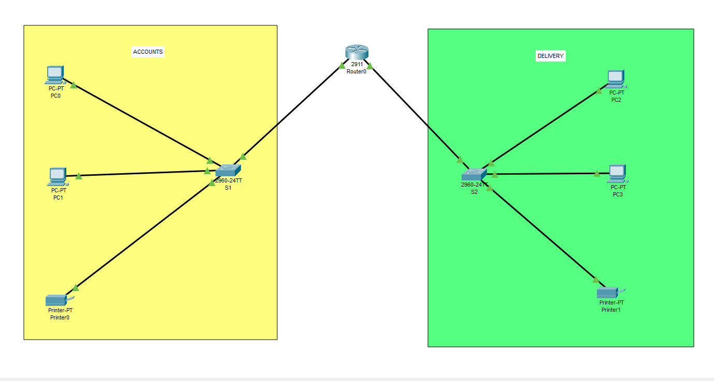

# Accounts-Delivery Network Project



---

## 📌 Project Overview

This project simulates a **real-world networking scenario** connecting **Accounts** and **Delivery** departments using **Cisco Packet Tracer**.  
The goal is to design a network topology with multiple subnets, assign IP addresses, configure routers, and test communication.

**Key Objectives:**

1. Each department contains at least **2 PCs and 1 printer**.  
2. Use appropriate number of **switches and routers**.  
3. Assign **IP addresses, subnet masks, and gateways**.  
4. Connect all devices using proper cables.  
5. Test communication between devices.

---

## 🖥️ Topology Design

- **Router:** 1 (Router0)  
- **Switches:** 2 (one per department)  
- **Hosts:**  
  - Accounts: 2 PCs + 1 Printer  
  - Delivery: 2 PCs + 1 Printer  
- **Subnetting:** 2 subnets (one per department)  

**Subnet Details:**

| Department | Network ID      | Subnet Mask       | IP Range         | Default Gateway |
|------------|----------------|-----------------|----------------|----------------|
| Accounts   | 192.168.40.0   | 255.255.255.128 | 192.168.40.1 - 126 | 192.168.40.1  |
| Delivery   | 192.168.40.128 | 255.255.255.128 | 192.168.40.129 - 254 | 192.168.40.129 |

> ✅ **Note:** Subnet mask is **/25 (255.255.255.128)** to divide the /24 network into two subnets, allowing up to 126 hosts per subnet.

---

## ⚙️ Router Configuration

### Interface Assignments:

```
Router0:
  Gig0/0 → 192.168.40.1 /25 (Accounts)
  Gig0/1 → 192.168.40.129 /25 (Delivery)
```
###Commands in Packet Tracer CLI:
```
enable
configure terminal
interface gig0/0
 ip address 192.168.40.1 255.255.255.128
 no shutdown
exit
interface gig0/1
 ip address 192.168.40.129 255.255.255.128
 no shutdown
exit
```

💻 Host Configuration

Accounts Subnet:

Device	   IP Address	    Subnet Mask	       Default Gateway
PC1	      192.168.40.2	  255.255.255.128	   192.168.40.1
PC2	      192.168.40.3	  255.255.255.128	   192.168.40.1
Printer	  192.168.40.4	  255.255.255.128	   192.168.40.1

Delivery Subnet:

Device	   IP Address	    Subnet Mask	       Default Gateway
PC1	      192.168.40.130	255.255.255.128	   192.168.40.129
PC2	      192.168.40.131	255.255.255.128	   192.168.40.129
Printer	  192.168.40.132	255.255.255.128	   192.168.40.129

🧪 Testing Communication
```
ping 192.168.40.130
ping 192.168.40.132
```

✅ Project Summary

This project demonstrates a basic yet complete network setup connecting two departments with proper subnetting, IP addressing, and router configuration. Key takeaways:

Subnetting a /24 network into /25 subnets for department isolation.

Assigning static IP addresses and default gateways for hosts.

Configuring router interfaces and testing connectivity using ping.

Structuring a simple topology in Cisco Packet Tracer with switches, PCs, and printers.
